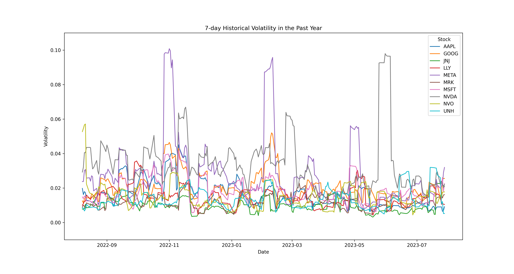
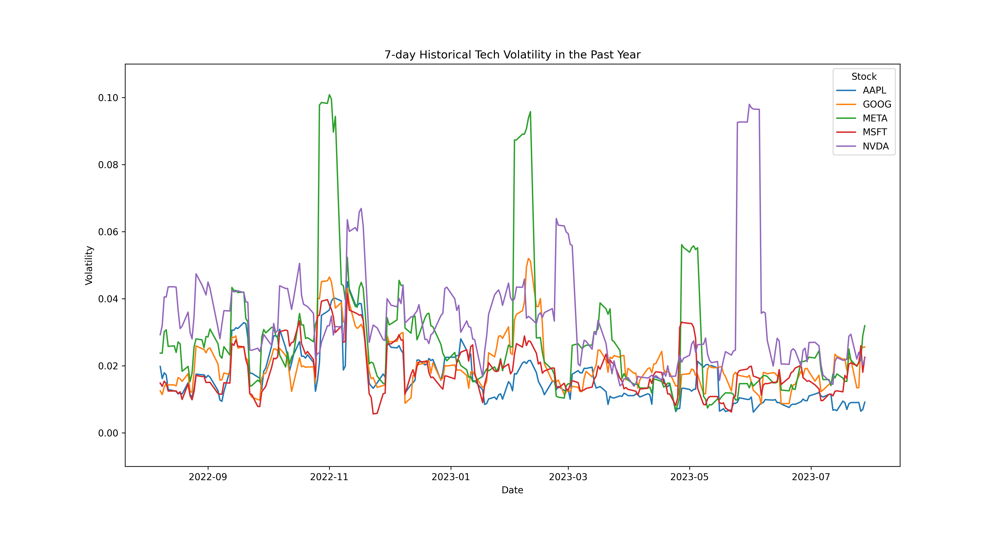
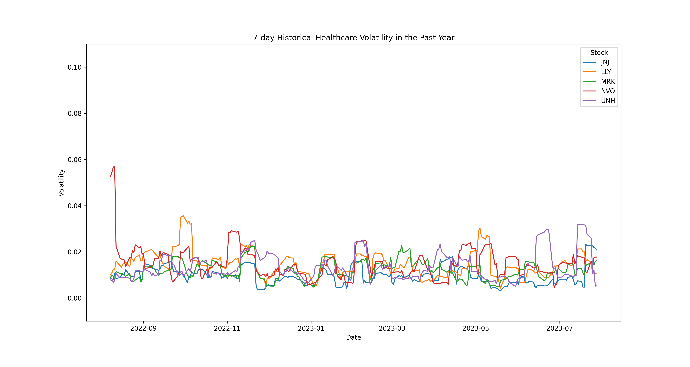

<br>

---

<br>

## Introduction

<br>

One key factor that investors take into consideration for their investments is volatility. **Volatility is the degree of variation in the price of a financial asset over time**. It is often used as a risk measurement for an investment's return. A high volatility is a sign that the price of an investment fluctuates significantly over time while a low volatility offers a  more stable price. Having one over the other doesn't definitively grant someone an advantage though, as it is primarily based on the investor's personal strategy.

<br>


<br>

**Prediction:** Since there has been a lot more hype towards technology and its stocks over recent times than the healthcare sector, I expect that the tech stocks should be more volatile. Hype and trends not only have the potential to drive stocks upwards, but they can also do the exact opposite. Also, companies in the technology space can experiment a lot more than healthcare companies. This is due to safety regulations, pace of product development, larger consumer base, and more. The fact that tech is changing a lot quicker overall means that stock prices in this sector have a higher opportunity to fluctuate more on average.

<br>

---

<br>

## Data Collection

<br>

Before collecting the data, we must import some packages. These will not only help us for this stage but also for later on.

<br>

```python
import yfinance as yf
import pandas as pd
import scipy.stats as stats
import numpy as np
import seaborn as sns
from matplotlib import pyplot as plt
```

<br>

Using the following dataset of **252 rows** and **60 columns**, we can find out **whether or not the top tech stocks are more volatile than the top healthcare stocks**. This dataset contains daily stock information in the past year from **5 popular tech stocks** and **5 popular healthcare stocks**. Each of the stocks are listed below:

#### Tech
- Apple (AAPL)
- Microsoft (MSFT)
- Google (GOOG)
- NVIDIA (NVDA)
- Meta (META)

#### Healthcare
- UnitedHealth (UNH)
- Johnson & Johnson (JNJ)
- Eli Lilly (LLY)
- Novo Nordisk (NVO)
- Merck (MRK)

<br>

For each of the stocks, importing from <a href="https://pypi.org/project/yfinance/">yfinance</a> gives the default columns of **Date**, **Open**, **High**, **Low**, **Close**, **Adj Close**, and **Volume**.

<br>

| Column | Description|
| --------- | --------- |
| 'Date' | Date in DD/MM/YYYY |
| 'Open' | Opening price |
| 'High' | Highest price |
| 'Low' | Lowest price |
| 'Close' | Closing price |
| 'Adj Close' | Adjusted closing price |
| 'Volume' | Volume of shares |

<br>
<br>

Here's how we download the stock info that we need:

<br>

```python
tickers = ["AAPL", "MSFT", "GOOG", "NVDA", "META", "UNH", "JNJ", "LLY", "NVO", "MRK"]
stocks = yf.download(tickers, period='1y')
```

<br>

And here's the head of the imported dataframe:

<br>

```python
stocks.head(5)
```
<br>

<table border="1" class="dataframe">
  <thead>
    <tr>
      <th></th>
      <th colspan="10" halign="left">Adj Close</th>
      <th colspan="10" halign="left">Close</th>
      <th colspan="10" halign="left">High</th>
      <th colspan="10" halign="left">Low</th>
      <th colspan="10" halign="left">Open</th>
      <th colspan="10" halign="left">Volume</th>
    </tr>
    <tr>
      <th></th>
      <th>AAPL</th>
      <th>GOOG</th>
      <th>JNJ</th>
      <th>LLY</th>
      <th>META</th>
      <th>MRK</th>
      <th>MSFT</th>
      <th>NVDA</th>
      <th>NVO</th>
      <th>UNH</th>
      <th>AAPL</th>
      <th>GOOG</th>
      <th>JNJ</th>
      <th>LLY</th>
      <th>META</th>
      <th>MRK</th>
      <th>MSFT</th>
      <th>NVDA</th>
      <th>NVO</th>
      <th>UNH</th>
      <th>AAPL</th>
      <th>GOOG</th>
      <th>JNJ</th>
      <th>LLY</th>
      <th>META</th>
      <th>MRK</th>
      <th>MSFT</th>
      <th>NVDA</th>
      <th>NVO</th>
      <th>UNH</th>
      <th>AAPL</th>
      <th>GOOG</th>
      <th>JNJ</th>
      <th>LLY</th>
      <th>META</th>
      <th>MRK</th>
      <th>MSFT</th>
      <th>NVDA</th>
      <th>NVO</th>
      <th>UNH</th>
      <th>AAPL</th>
      <th>GOOG</th>
      <th>JNJ</th>
      <th>LLY</th>
      <th>META</th>
      <th>MRK</th>
      <th>MSFT</th>
      <th>NVDA</th>
      <th>NVO</th>
      <th>UNH</th>
      <th>AAPL</th>
      <th>GOOG</th>
      <th>JNJ</th>
      <th>LLY</th>
      <th>META</th>
      <th>MRK</th>
      <th>MSFT</th>
      <th>NVDA</th>
      <th>NVO</th>
      <th>UNH</th>
    </tr>
    <tr>
      <th>Date</th>
      <th></th>
      <th></th>
      <th></th>
      <th></th>
      <th></th>
      <th></th>
      <th></th>
      <th></th>
      <th></th>
      <th></th>
      <th></th>
      <th></th>
      <th></th>
      <th></th>
      <th></th>
      <th></th>
      <th></th>
      <th></th>
      <th></th>
      <th></th>
      <th></th>
      <th></th>
      <th></th>
      <th></th>
      <th></th>
      <th></th>
      <th></th>
      <th></th>
      <th></th>
      <th></th>
      <th></th>
      <th></th>
      <th></th>
      <th></th>
      <th></th>
      <th></th>
      <th></th>
      <th></th>
      <th></th>
      <th></th>
      <th></th>
      <th></th>
      <th></th>
      <th></th>
      <th></th>
      <th></th>
      <th></th>
      <th></th>
      <th></th>
      <th></th>
      <th></th>
      <th></th>
      <th></th>
      <th></th>
      <th></th>
      <th></th>
      <th></th>
      <th></th>
      <th></th>
      <th></th>
    </tr>
  </thead>
  <tbody>
    <tr>
      <th>2022-07-27</th>
      <td>155.859314</td>
      <td>113.599998</td>
      <td>168.449051</td>
      <td>325.057617</td>
      <td>169.580002</td>
      <td>88.691444</td>
      <td>266.167145</td>
      <td>177.753067</td>
      <td>115.377831</td>
      <td>527.249939</td>
      <td>156.789993</td>
      <td>113.599998</td>
      <td>173.199997</td>
      <td>328.940002</td>
      <td>169.580002</td>
      <td>91.230003</td>
      <td>268.739990</td>
      <td>177.899994</td>
      <td>116.930000</td>
      <td>534.609985</td>
      <td>157.330002</td>
      <td>114.400002</td>
      <td>174.100006</td>
      <td>330.869995</td>
      <td>170.869995</td>
      <td>91.370003</td>
      <td>270.049988</td>
      <td>179.360001</td>
      <td>117.209999</td>
      <td>537.859985</td>
      <td>152.160004</td>
      <td>108.419998</td>
      <td>171.130005</td>
      <td>325.190002</td>
      <td>162.020004</td>
      <td>90.010002</td>
      <td>258.850006</td>
      <td>169.130005</td>
      <td>114.699997</td>
      <td>528.039978</td>
      <td>152.580002</td>
      <td>109.599998</td>
      <td>172.630005</td>
      <td>328.980011</td>
      <td>162.589996</td>
      <td>90.500000</td>
      <td>261.160004</td>
      <td>170.320007</td>
      <td>114.830002</td>
      <td>533.539978</td>
      <td>78620700</td>
      <td>41474600</td>
      <td>4648500</td>
      <td>1643000</td>
      <td>43846600</td>
      <td>6966300</td>
      <td>45994000</td>
      <td>56977600</td>
      <td>1026400</td>
      <td>2268100</td>
    </tr>
    <tr>
      <th>2022-07-28</th>
      <td>156.416016</td>
      <td>114.589996</td>
      <td>169.421616</td>
      <td>326.895691</td>
      <td>160.720001</td>
      <td>87.437332</td>
      <td>273.763733</td>
      <td>179.691467</td>
      <td>114.844994</td>
      <td>534.035217</td>
      <td>157.350006</td>
      <td>114.589996</td>
      <td>174.199997</td>
      <td>330.799988</td>
      <td>160.720001</td>
      <td>89.940002</td>
      <td>276.410004</td>
      <td>179.839996</td>
      <td>116.389999</td>
      <td>541.489990</td>
      <td>157.639999</td>
      <td>114.699997</td>
      <td>176.089996</td>
      <td>333.589996</td>
      <td>161.509995</td>
      <td>91.129997</td>
      <td>277.839996</td>
      <td>181.399994</td>
      <td>116.820000</td>
      <td>544.340027</td>
      <td>154.410004</td>
      <td>111.850998</td>
      <td>171.440002</td>
      <td>321.739990</td>
      <td>154.850006</td>
      <td>87.419998</td>
      <td>267.869995</td>
      <td>174.399994</td>
      <td>113.220001</td>
      <td>531.739990</td>
      <td>156.979996</td>
      <td>112.800003</td>
      <td>173.399994</td>
      <td>330.239990</td>
      <td>161.059998</td>
      <td>91.040001</td>
      <td>269.750000</td>
      <td>179.750000</td>
      <td>114.750000</td>
      <td>537.489990</td>
      <td>81378700</td>
      <td>23303800</td>
      <td>5513000</td>
      <td>2350900</td>
      <td>73214300</td>
      <td>13909800</td>
      <td>33459300</td>
      <td>47464600</td>
      <td>769900</td>
      <td>2344500</td>
    </tr>
    <tr>
      <th>2022-07-29</th>
      <td>161.545364</td>
      <td>116.639999</td>
      <td>169.732849</td>
      <td>325.798798</td>
      <td>159.100006</td>
      <td>86.854027</td>
      <td>278.052277</td>
      <td>181.479996</td>
      <td>114.519371</td>
      <td>534.873596</td>
      <td>162.509995</td>
      <td>116.639999</td>
      <td>174.520004</td>
      <td>329.690002</td>
      <td>159.100006</td>
      <td>89.339996</td>
      <td>280.739990</td>
      <td>181.630005</td>
      <td>116.059998</td>
      <td>542.340027</td>
      <td>163.630005</td>
      <td>116.900002</td>
      <td>174.850006</td>
      <td>331.059998</td>
      <td>160.139999</td>
      <td>91.080002</td>
      <td>282.000000</td>
      <td>182.440002</td>
      <td>117.239998</td>
      <td>543.849976</td>
      <td>159.500000</td>
      <td>113.230003</td>
      <td>172.910004</td>
      <td>326.820007</td>
      <td>155.169998</td>
      <td>88.279999</td>
      <td>276.630005</td>
      <td>176.919998</td>
      <td>115.769997</td>
      <td>536.690002</td>
      <td>161.240005</td>
      <td>113.400002</td>
      <td>173.789993</td>
      <td>331.059998</td>
      <td>157.690002</td>
      <td>90.080002</td>
      <td>277.700012</td>
      <td>178.130005</td>
      <td>117.150002</td>
      <td>540.010010</td>
      <td>101786900</td>
      <td>31336200</td>
      <td>6451400</td>
      <td>3399900</td>
      <td>42065400</td>
      <td>14938600</td>
      <td>32152800</td>
      <td>43546000</td>
      <td>1208000</td>
      <td>2945700</td>
    </tr>
    <tr>
      <th>2022-08-01</th>
      <td>160.551300</td>
      <td>115.480003</td>
      <td>169.139572</td>
      <td>320.324158</td>
      <td>159.929993</td>
      <td>86.066566</td>
      <td>275.348450</td>
      <td>184.257706</td>
      <td>114.548973</td>
      <td>528.009338</td>
      <td>161.509995</td>
      <td>115.480003</td>
      <td>173.910004</td>
      <td>324.149994</td>
      <td>159.929993</td>
      <td>88.529999</td>
      <td>278.010010</td>
      <td>184.410004</td>
      <td>116.089996</td>
      <td>535.380005</td>
      <td>163.589996</td>
      <td>117.120003</td>
      <td>175.160004</td>
      <td>330.429993</td>
      <td>165.190002</td>
      <td>90.019997</td>
      <td>281.279999</td>
      <td>188.460007</td>
      <td>117.419998</td>
      <td>543.650024</td>
      <td>160.889999</td>
      <td>114.690002</td>
      <td>173.539993</td>
      <td>323.459991</td>
      <td>155.229996</td>
      <td>88.349998</td>
      <td>275.839996</td>
      <td>179.899994</td>
      <td>115.870003</td>
      <td>531.000000</td>
      <td>161.009995</td>
      <td>115.529999</td>
      <td>174.169998</td>
      <td>327.510010</td>
      <td>157.250000</td>
      <td>89.339996</td>
      <td>277.820007</td>
      <td>181.820007</td>
      <td>116.940002</td>
      <td>542.270020</td>
      <td>67829400</td>
      <td>22856200</td>
      <td>5461400</td>
      <td>2464300</td>
      <td>40596700</td>
      <td>7343300</td>
      <td>21539600</td>
      <td>47646900</td>
      <td>1186200</td>
      <td>2335000</td>
    </tr>
    <tr>
      <th>2022-08-02</th>
      <td>159.060196</td>
      <td>115.900002</td>
      <td>168.176727</td>
      <td>316.420807</td>
      <td>160.190002</td>
      <td>85.172173</td>
      <td>272.188965</td>
      <td>185.106979</td>
      <td>112.940613</td>
      <td>528.088257</td>
      <td>160.009995</td>
      <td>115.900002</td>
      <td>172.919998</td>
      <td>320.200012</td>
      <td>160.190002</td>
      <td>87.610001</td>
      <td>274.820007</td>
      <td>185.259995</td>
      <td>114.459999</td>
      <td>535.460022</td>
      <td>162.410004</td>
      <td>117.080002</td>
      <td>175.490005</td>
      <td>328.980011</td>
      <td>162.240005</td>
      <td>89.589996</td>
      <td>277.890015</td>
      <td>189.380005</td>
      <td>117.239998</td>
      <td>540.530029</td>
      <td>159.630005</td>
      <td>114.260002</td>
      <td>172.699997</td>
      <td>319.359985</td>
      <td>158.009995</td>
      <td>87.550003</td>
      <td>272.380005</td>
      <td>180.919998</td>
      <td>114.459999</td>
      <td>531.719971</td>
      <td>160.100006</td>
      <td>114.430000</td>
      <td>175.009995</td>
      <td>327.190002</td>
      <td>158.309998</td>
      <td>89.059998</td>
      <td>276.000000</td>
      <td>181.220001</td>
      <td>116.639999</td>
      <td>537.549988</td>
      <td>59907000</td>
      <td>17911000</td>
      <td>5794200</td>
      <td>3405700</td>
      <td>27374500</td>
      <td>7443000</td>
      <td>22754200</td>
      <td>48952700</td>
      <td>895800</td>
      <td>2114200</td>
    </tr>
  </tbody>
</table>

<br>

---

<br>

## Data Cleaning
<br>

Since we are calculating the **volatility** of each stock, we will only need to keep the **Date** and **Close** columns for the closing prices for each day. Let's filter to only keep those ones (Note that because we're filtering by a column from a groupby DataFrame, the new columns will simply be the name of the stocks indexed by the dates).

<br>

```python
stocks_close = stocks['Close']
stocks_close.head(5)
```

<table border="1" class="dataframe">
  <thead>
    <tr style="text-align: right;">
      <th></th>
      <th>AAPL</th>
      <th>GOOG</th>
      <th>JNJ</th>
      <th>LLY</th>
      <th>META</th>
      <th>MRK</th>
      <th>MSFT</th>
      <th>NVDA</th>
      <th>NVO</th>
      <th>UNH</th>
    </tr>
    <tr>
      <th>Date</th>
      <th></th>
      <th></th>
      <th></th>
      <th></th>
      <th></th>
      <th></th>
      <th></th>
      <th></th>
      <th></th>
      <th></th>
    </tr>
  </thead>
  <tbody>
    <tr>
      <th>2022-07-28</th>
      <td>157.350006</td>
      <td>114.589996</td>
      <td>174.199997</td>
      <td>330.799988</td>
      <td>160.720001</td>
      <td>89.940002</td>
      <td>276.410004</td>
      <td>179.839996</td>
      <td>116.389999</td>
      <td>541.489990</td>
    </tr>
    <tr>
      <th>2022-07-29</th>
      <td>162.509995</td>
      <td>116.639999</td>
      <td>174.520004</td>
      <td>329.690002</td>
      <td>159.100006</td>
      <td>89.339996</td>
      <td>280.739990</td>
      <td>181.630005</td>
      <td>116.059998</td>
      <td>542.340027</td>
    </tr>
    <tr>
      <th>2022-08-01</th>
      <td>161.509995</td>
      <td>115.480003</td>
      <td>173.910004</td>
      <td>324.149994</td>
      <td>159.929993</td>
      <td>88.529999</td>
      <td>278.010010</td>
      <td>184.410004</td>
      <td>116.089996</td>
      <td>535.380005</td>
    </tr>
    <tr>
      <th>2022-08-02</th>
      <td>160.009995</td>
      <td>115.900002</td>
      <td>172.919998</td>
      <td>320.200012</td>
      <td>160.190002</td>
      <td>87.610001</td>
      <td>274.820007</td>
      <td>185.259995</td>
      <td>114.459999</td>
      <td>535.460022</td>
    </tr>
    <tr>
      <th>2022-08-03</th>
      <td>166.130005</td>
      <td>118.779999</td>
      <td>174.589996</td>
      <td>313.829987</td>
      <td>168.800003</td>
      <td>87.620003</td>
      <td>282.470001</td>
      <td>188.929993</td>
      <td>99.910004</td>
      <td>540.650024</td>
    </tr>
  </tbody>
</table>

<br>
<br>

Next, we need to calculate the volatility column. Let's make one for **7-day historical volatility**, which takes the standard deviation of the price changes within the last seven days for each day of a stock. The combination of these methods converts the closing prices to this specific measurement.

<br>

```python
stocks_vol = (stocks_close.pct_change().rolling(7).std()).reset_index()
stocks_vol.head(20)
```

<table border="1" class="dataframe">
  <thead>
    <tr style="text-align: right;">
      <th></th>
      <th>Date</th>
      <th>AAPL</th>
      <th>GOOG</th>
      <th>JNJ</th>
      <th>LLY</th>
      <th>META</th>
      <th>MRK</th>
      <th>MSFT</th>
      <th>NVDA</th>
      <th>NVO</th>
      <th>UNH</th>
    </tr>
  </thead>
  <tbody>
    <tr>
      <th>0</th>
      <td>2022-07-28</td>
      <td>NaN</td>
      <td>NaN</td>
      <td>NaN</td>
      <td>NaN</td>
      <td>NaN</td>
      <td>NaN</td>
      <td>NaN</td>
      <td>NaN</td>
      <td>NaN</td>
      <td>NaN</td>
    </tr>
    <tr>
      <th>1</th>
      <td>2022-07-29</td>
      <td>NaN</td>
      <td>NaN</td>
      <td>NaN</td>
      <td>NaN</td>
      <td>NaN</td>
      <td>NaN</td>
      <td>NaN</td>
      <td>NaN</td>
      <td>NaN</td>
      <td>NaN</td>
    </tr>
    <tr>
      <th>2</th>
      <td>2022-08-01</td>
      <td>NaN</td>
      <td>NaN</td>
      <td>NaN</td>
      <td>NaN</td>
      <td>NaN</td>
      <td>NaN</td>
      <td>NaN</td>
      <td>NaN</td>
      <td>NaN</td>
      <td>NaN</td>
    </tr>
    <tr>
      <th>3</th>
      <td>2022-08-02</td>
      <td>NaN</td>
      <td>NaN</td>
      <td>NaN</td>
      <td>NaN</td>
      <td>NaN</td>
      <td>NaN</td>
      <td>NaN</td>
      <td>NaN</td>
      <td>NaN</td>
      <td>NaN</td>
    </tr>
    <tr>
      <th>4</th>
      <td>2022-08-03</td>
      <td>NaN</td>
      <td>NaN</td>
      <td>NaN</td>
      <td>NaN</td>
      <td>NaN</td>
      <td>NaN</td>
      <td>NaN</td>
      <td>NaN</td>
      <td>NaN</td>
      <td>NaN</td>
    </tr>
    <tr>
      <th>5</th>
      <td>2022-08-04</td>
      <td>NaN</td>
      <td>NaN</td>
      <td>NaN</td>
      <td>NaN</td>
      <td>NaN</td>
      <td>NaN</td>
      <td>NaN</td>
      <td>NaN</td>
      <td>NaN</td>
      <td>NaN</td>
    </tr>
    <tr>
      <th>6</th>
      <td>2022-08-05</td>
      <td>NaN</td>
      <td>NaN</td>
      <td>NaN</td>
      <td>NaN</td>
      <td>NaN</td>
      <td>NaN</td>
      <td>NaN</td>
      <td>NaN</td>
      <td>NaN</td>
      <td>NaN</td>
    </tr>
    <tr>
      <th>7</th>
      <td>2022-08-08</td>
      <td>0.019804</td>
      <td>0.012536</td>
      <td>0.007819</td>
      <td>0.010024</td>
      <td>0.023767</td>
      <td>0.008948</td>
      <td>0.014853</td>
      <td>0.029251</td>
      <td>0.052709</td>
      <td>0.008437</td>
    </tr>
    <tr>
      <th>8</th>
      <td>2022-08-09</td>
      <td>0.016189</td>
      <td>0.011412</td>
      <td>0.007638</td>
      <td>0.010949</td>
      <td>0.023770</td>
      <td>0.010059</td>
      <td>0.013867</td>
      <td>0.032007</td>
      <td>0.054534</td>
      <td>0.008419</td>
    </tr>
    <tr>
      <th>9</th>
      <td>2022-08-10</td>
      <td>0.017926</td>
      <td>0.013705</td>
      <td>0.008019</td>
      <td>0.012389</td>
      <td>0.030137</td>
      <td>0.009406</td>
      <td>0.015410</td>
      <td>0.040542</td>
      <td>0.056637</td>
      <td>0.006715</td>
    </tr>
    <tr>
      <th>10</th>
      <td>2022-08-11</td>
      <td>0.017280</td>
      <td>0.014600</td>
      <td>0.010563</td>
      <td>0.012353</td>
      <td>0.030738</td>
      <td>0.008235</td>
      <td>0.014713</td>
      <td>0.040491</td>
      <td>0.057133</td>
      <td>0.007659</td>
    </tr>
    <tr>
      <th>11</th>
      <td>2022-08-12</td>
      <td>0.012915</td>
      <td>0.014324</td>
      <td>0.008545</td>
      <td>0.015943</td>
      <td>0.025785</td>
      <td>0.011399</td>
      <td>0.012477</td>
      <td>0.043540</td>
      <td>0.022331</td>
      <td>0.010566</td>
    </tr>
    <tr>
      <th>12</th>
      <td>2022-08-15</td>
      <td>0.012535</td>
      <td>0.014279</td>
      <td>0.008798</td>
      <td>0.013974</td>
      <td>0.025945</td>
      <td>0.010527</td>
      <td>0.012475</td>
      <td>0.043555</td>
      <td>0.017193</td>
      <td>0.008711</td>
    </tr>
    <tr>
      <th>13</th>
      <td>2022-08-16</td>
      <td>0.012329</td>
      <td>0.014011</td>
      <td>0.010226</td>
      <td>0.013334</td>
      <td>0.023981</td>
      <td>0.010778</td>
      <td>0.012473</td>
      <td>0.043418</td>
      <td>0.016883</td>
      <td>0.008709</td>
    </tr>
    <tr>
      <th>14</th>
      <td>2022-08-17</td>
      <td>0.011602</td>
      <td>0.016498</td>
      <td>0.010219</td>
      <td>0.014741</td>
      <td>0.027113</td>
      <td>0.010308</td>
      <td>0.011732</td>
      <td>0.036534</td>
      <td>0.016628</td>
      <td>0.008914</td>
    </tr>
    <tr>
      <th>15</th>
      <td>2022-08-18</td>
      <td>0.011935</td>
      <td>0.016103</td>
      <td>0.010217</td>
      <td>0.014875</td>
      <td>0.026532</td>
      <td>0.009768</td>
      <td>0.012227</td>
      <td>0.031100</td>
      <td>0.016479</td>
      <td>0.008935</td>
    </tr>
    <tr>
      <th>16</th>
      <td>2022-08-19</td>
      <td>0.011568</td>
      <td>0.015339</td>
      <td>0.012237</td>
      <td>0.015596</td>
      <td>0.018348</td>
      <td>0.009394</td>
      <td>0.009963</td>
      <td>0.031808</td>
      <td>0.013498</td>
      <td>0.009006</td>
    </tr>
    <tr>
      <th>17</th>
      <td>2022-08-22</td>
      <td>0.014931</td>
      <td>0.017650</td>
      <td>0.009838</td>
      <td>0.013565</td>
      <td>0.019816</td>
      <td>0.010636</td>
      <td>0.014549</td>
      <td>0.035990</td>
      <td>0.017633</td>
      <td>0.008550</td>
    </tr>
    <tr>
      <th>18</th>
      <td>2022-08-23</td>
      <td>0.011342</td>
      <td>0.012414</td>
      <td>0.009422</td>
      <td>0.017492</td>
      <td>0.015305</td>
      <td>0.007262</td>
      <td>0.011066</td>
      <td>0.029962</td>
      <td>0.017393</td>
      <td>0.007341</td>
    </tr>
    <tr>
      <th>19</th>
      <td>2022-08-24</td>
      <td>0.010765</td>
      <td>0.012069</td>
      <td>0.009342</td>
      <td>0.016621</td>
      <td>0.017884</td>
      <td>0.007130</td>
      <td>0.009873</td>
      <td>0.028029</td>
      <td>0.020758</td>
      <td>0.007300</td>
    </tr>
  </tbody>
</table>

<br>
<br>

Note that the **first 7 rows** have **N/A** values because the <a href="https://pandas.pydata.org/pandas-docs/stable/reference/api/pandas.DataFrame.rolling.html">rolling()</a> function helps us calculate the volatility of the **last 7 days** for each day. Let's drop those N/A values.

<br>

```python
stocks_vol = stocks_vol.dropna()
stocks_head(20)
```

<table border="1" class="dataframe">
  <thead>
    <tr style="text-align: right;">
      <th></th>
      <th>Date</th>
      <th>AAPL</th>
      <th>GOOG</th>
      <th>JNJ</th>
      <th>LLY</th>
      <th>META</th>
      <th>MRK</th>
      <th>MSFT</th>
      <th>NVDA</th>
      <th>NVO</th>
      <th>UNH</th>
    </tr>
  </thead>
  <tbody>
    <tr>
      <th>7</th>
      <td>2022-08-08</td>
      <td>0.019804</td>
      <td>0.012536</td>
      <td>0.007819</td>
      <td>0.010024</td>
      <td>0.023767</td>
      <td>0.008948</td>
      <td>0.014853</td>
      <td>0.029251</td>
      <td>0.052709</td>
      <td>0.008437</td>
    </tr>
    <tr>
      <th>8</th>
      <td>2022-08-09</td>
      <td>0.016189</td>
      <td>0.011412</td>
      <td>0.007638</td>
      <td>0.010949</td>
      <td>0.023770</td>
      <td>0.010059</td>
      <td>0.013867</td>
      <td>0.032007</td>
      <td>0.054534</td>
      <td>0.008419</td>
    </tr>
    <tr>
      <th>9</th>
      <td>2022-08-10</td>
      <td>0.017926</td>
      <td>0.013705</td>
      <td>0.008019</td>
      <td>0.012389</td>
      <td>0.030137</td>
      <td>0.009406</td>
      <td>0.015410</td>
      <td>0.040542</td>
      <td>0.056637</td>
      <td>0.006715</td>
    </tr>
    <tr>
      <th>10</th>
      <td>2022-08-11</td>
      <td>0.017280</td>
      <td>0.014600</td>
      <td>0.010563</td>
      <td>0.012353</td>
      <td>0.030738</td>
      <td>0.008235</td>
      <td>0.014713</td>
      <td>0.040491</td>
      <td>0.057133</td>
      <td>0.007659</td>
    </tr>
    <tr>
      <th>11</th>
      <td>2022-08-12</td>
      <td>0.012915</td>
      <td>0.014324</td>
      <td>0.008545</td>
      <td>0.015943</td>
      <td>0.025785</td>
      <td>0.011399</td>
      <td>0.012477</td>
      <td>0.043540</td>
      <td>0.022331</td>
      <td>0.010566</td>
    </tr>
    <tr>
      <th>12</th>
      <td>2022-08-15</td>
      <td>0.012535</td>
      <td>0.014279</td>
      <td>0.008798</td>
      <td>0.013974</td>
      <td>0.025945</td>
      <td>0.010527</td>
      <td>0.012475</td>
      <td>0.043555</td>
      <td>0.017193</td>
      <td>0.008711</td>
    </tr>
    <tr>
      <th>13</th>
      <td>2022-08-16</td>
      <td>0.012329</td>
      <td>0.014011</td>
      <td>0.010226</td>
      <td>0.013334</td>
      <td>0.023981</td>
      <td>0.010778</td>
      <td>0.012473</td>
      <td>0.043418</td>
      <td>0.016883</td>
      <td>0.008709</td>
    </tr>
    <tr>
      <th>14</th>
      <td>2022-08-17</td>
      <td>0.011602</td>
      <td>0.016498</td>
      <td>0.010219</td>
      <td>0.014741</td>
      <td>0.027113</td>
      <td>0.010308</td>
      <td>0.011732</td>
      <td>0.036534</td>
      <td>0.016628</td>
      <td>0.008914</td>
    </tr>
    <tr>
      <th>15</th>
      <td>2022-08-18</td>
      <td>0.011935</td>
      <td>0.016103</td>
      <td>0.010217</td>
      <td>0.014875</td>
      <td>0.026532</td>
      <td>0.009768</td>
      <td>0.012227</td>
      <td>0.031100</td>
      <td>0.016479</td>
      <td>0.008935</td>
    </tr>
    <tr>
      <th>16</th>
      <td>2022-08-19</td>
      <td>0.011568</td>
      <td>0.015339</td>
      <td>0.012237</td>
      <td>0.015596</td>
      <td>0.018348</td>
      <td>0.009394</td>
      <td>0.009963</td>
      <td>0.031808</td>
      <td>0.013498</td>
      <td>0.009006</td>
    </tr>
    <tr>
      <th>17</th>
      <td>2022-08-22</td>
      <td>0.014931</td>
      <td>0.017650</td>
      <td>0.009838</td>
      <td>0.013565</td>
      <td>0.019816</td>
      <td>0.010636</td>
      <td>0.014549</td>
      <td>0.035990</td>
      <td>0.017633</td>
      <td>0.008550</td>
    </tr>
    <tr>
      <th>18</th>
      <td>2022-08-23</td>
      <td>0.011342</td>
      <td>0.012414</td>
      <td>0.009422</td>
      <td>0.017492</td>
      <td>0.015305</td>
      <td>0.007262</td>
      <td>0.011066</td>
      <td>0.029962</td>
      <td>0.017393</td>
      <td>0.007341</td>
    </tr>
    <tr>
      <th>19</th>
      <td>2022-08-24</td>
      <td>0.010765</td>
      <td>0.012069</td>
      <td>0.009342</td>
      <td>0.016621</td>
      <td>0.017884</td>
      <td>0.007130</td>
      <td>0.009873</td>
      <td>0.028029</td>
      <td>0.020758</td>
      <td>0.007300</td>
    </tr>
    <tr>
      <th>20</th>
      <td>2022-08-25</td>
      <td>0.013101</td>
      <td>0.018235</td>
      <td>0.009418</td>
      <td>0.015796</td>
      <td>0.025667</td>
      <td>0.007275</td>
      <td>0.012350</td>
      <td>0.034785</td>
      <td>0.019785</td>
      <td>0.008422</td>
    </tr>
    <tr>
      <th>21</th>
      <td>2022-08-26</td>
      <td>0.017512</td>
      <td>0.025935</td>
      <td>0.011338</td>
      <td>0.017562</td>
      <td>0.028014</td>
      <td>0.007801</td>
      <td>0.017103</td>
      <td>0.047412</td>
      <td>0.023032</td>
      <td>0.011758</td>
    </tr>
    <tr>
      <th>22</th>
      <td>2022-08-29</td>
      <td>0.017307</td>
      <td>0.025109</td>
      <td>0.011477</td>
      <td>0.018660</td>
      <td>0.027730</td>
      <td>0.009126</td>
      <td>0.016783</td>
      <td>0.044075</td>
      <td>0.021740</td>
      <td>0.011797</td>
    </tr>
    <tr>
      <th>23</th>
      <td>2022-08-30</td>
      <td>0.017315</td>
      <td>0.024862</td>
      <td>0.008170</td>
      <td>0.016011</td>
      <td>0.025391</td>
      <td>0.006929</td>
      <td>0.016839</td>
      <td>0.042593</td>
      <td>0.022251</td>
      <td>0.011343</td>
    </tr>
    <tr>
      <th>24</th>
      <td>2022-08-31</td>
      <td>0.016459</td>
      <td>0.023859</td>
      <td>0.007971</td>
      <td>0.016120</td>
      <td>0.028723</td>
      <td>0.007773</td>
      <td>0.015021</td>
      <td>0.041138</td>
      <td>0.018975</td>
      <td>0.011343</td>
    </tr>
    <tr>
      <th>25</th>
      <td>2022-09-01</td>
      <td>0.017115</td>
      <td>0.025045</td>
      <td>0.013666</td>
      <td>0.019438</td>
      <td>0.028621</td>
      <td>0.013765</td>
      <td>0.015049</td>
      <td>0.044951</td>
      <td>0.019456</td>
      <td>0.011831</td>
    </tr>
    <tr>
      <th>26</th>
      <td>2022-09-02</td>
      <td>0.016632</td>
      <td>0.025319</td>
      <td>0.014832</td>
      <td>0.019882</td>
      <td>0.030954</td>
      <td>0.013857</td>
      <td>0.015062</td>
      <td>0.043107</td>
      <td>0.012913</td>
      <td>0.012362</td>
    </tr>
  </tbody>
</table>

<br>
<br>
     
In order to make our hypothesis test easier, we'll first melt the dataframe (converting the columns into a single **Stock** column), and then we can split up the stocks by sector: One for **tech**, one for **healthcare**

<br>

```python
data = pd.melt(stocks_vol, ['Date'])
data['Volatility'] = data['value']
data['Stock'] = data['variable']
data = data.drop(columns=['variable', 'value'])
```
<br>
<br>

```python
tech = data[data['Stock'].str.contains('AAPL|MSFT|GOOG|NVDA|META')]
tech.head(5)
```

<table border="1" class="dataframe">
  <thead>
    <tr style="text-align: right;">
      <th></th>
      <th>Date</th>
      <th>Volatility</th>
      <th>Stock</th>
    </tr>
  </thead>
  <tbody>
    <tr>
      <th>7</th>
      <td>2022-08-08</td>
      <td>0.019804</td>
      <td>AAPL</td>
    </tr>
    <tr>
      <th>8</th>
      <td>2022-08-09</td>
      <td>0.016189</td>
      <td>AAPL</td>
    </tr>
    <tr>
      <th>9</th>
      <td>2022-08-10</td>
      <td>0.017926</td>
      <td>AAPL</td>
    </tr>
    <tr>
      <th>10</th>
      <td>2022-08-11</td>
      <td>0.017280</td>
      <td>AAPL</td>
    </tr>
    <tr>
      <th>11</th>
      <td>2022-08-12</td>
      <td>0.012915</td>
      <td>AAPL</td>
    </tr>
  </tbody>
</table>

<br>
<br>

```python
healthcare = data[data['Stock'].str.contains('UNH|JNJ|LLY|NVO|MRK')]
healthcare.head(5)
```

<table border="1" class="dataframe">
  <thead>
    <tr style="text-align: right;">
      <th></th>
      <th>Date</th>
      <th>Volatility</th>
      <th>Stock</th>
    </tr>
  </thead>
  <tbody>
    <tr>
      <th>511</th>
      <td>2022-08-08</td>
      <td>0.007819</td>
      <td>JNJ</td>
    </tr>
    <tr>
      <th>512</th>
      <td>2022-08-09</td>
      <td>0.007638</td>
      <td>JNJ</td>
    </tr>
    <tr>
      <th>513</th>
      <td>2022-08-10</td>
      <td>0.008019</td>
      <td>JNJ</td>
    </tr>
    <tr>
      <th>514</th>
      <td>2022-08-11</td>
      <td>0.010563</td>
      <td>JNJ</td>
    </tr>
    <tr>
      <th>515</th>
      <td>2022-08-12</td>
      <td>0.008545</td>
      <td>JNJ</td>
    </tr>
  </tbody>
</table>

<br>

---

<br>

## Hypothesis Test & Analysis

<br>

- **Null Hypothesis:** In the population, there is no significant difference between the mean 7-day volatility of top tech stocks and healthcare stocks.


- **Alternate Hypothesis:** In the population, there is a significant difference between the mean 7-day volatility of top tech stocks and healthcare stocks.


- **Test Statistic:** t-value.


- **Significance Level:** 0.05

<br>
<br>

To compare the means of two independent groups of tech stocks and healthcare stocks, we can use <a href="https://en.wikipedia.org/wiki/Welch%27s_t-test">Welch's t-test</a>. While the <a href="https://en.wikipedia.org/wiki/Student%27s_t-test">Student's t-test</a> is also designed to answer this type of question, it requires both groups to have similar distributions or equal variance, which isn't the case here.

<br>

```python
tech['Volatility'].var()
```
    0.00019806318395024772
    
<br>

```python
healthcare['Volatility'].var()
```
    0.00003467019775565414

<br>
<br>

Using <a href="https://docs.scipy.org/doc/scipy/reference/generated/scipy.stats.ttest_ind.html">SciPy's independent Welch's t-test</a>, we can find out if there is a **significant difference** between the mean volatility of both types of stocks.

<br>

```python
print(stats.ttest_ind(tech['Volatility'], healthcare['Volatility'], equal_var=False))
```
    Ttest_indResult(statistic=-24.012998638598958, pvalue=1.9616001725784533e-109)  

<br>

As expected, the **p-value** comes out to be **very low**, and it's a lot **less than than our 0.05 significance level**. Because of this, we can **reject the null**, concluding that **there is a significant difference** between the mean 7-day volatility of top tech stocks and healthcare stocks.

<br>

To visualize this difference, we can plot the volatility with <a href="https://seaborn.pydata.org/index.html">Seaborn</a>, a popular Python data visualization library based on <a href="https://matplotlib.org/">matplotlib</a>.

<br>

```python
plt.figure(figsize=(15,8))
stock_graph = sns.lineplot(x='Date', y='Volatility', hue='Stock', data=data);
stock_graph.set_ylim(ymin=-0.01, ymax=0.11)
plt.title('7-day Historical Volatility in the Past Year')
plt.show()
```



<br>
<br>

This looks a little messy, so let's make separate graphs for tech and healthcare stocks to help better visualize the difference.

<br>

```python
plt.figure(figsize=(15,8))
stock_graph = sns.lineplot(x='Date', y='Volatility', hue='Stock', data=data);
stock_graph.set_ylim(ymin=-0.01, ymax=0.11)
plt.title('7-day Historical Volatility in the Past Year')
plt.show()
```

<br>



<br>

```python
plt.figure(figsize=(15,8))
healthcare_graph = sns.lineplot(x='Date', y='Volatility', hue='Stock', data=healthcare);
healthcare_graph.set_ylim(ymin=-0.01, ymax=0.11)
plt.title('7-day Historical Healthcare Volatility in the Past Year')
plt.show()
```

<br>



<br>

Along with the p-value, the graphs also show how **significant** of a difference there is between the volatilities of both sectors! Of course, these are **only some** of the top stocks in both tech and healthcare, but it's still a meaningful outcome.

<br>

---
